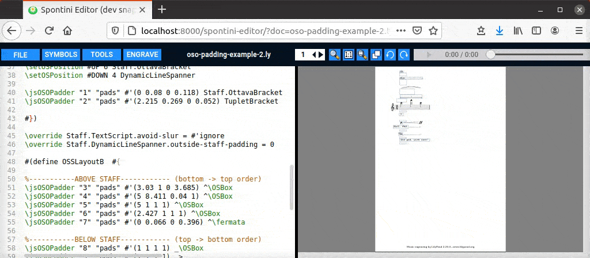

<!--
Created (20/11/2020) by Paolo-Prete.
This file is part of Spontini-Editor project.

Spontini-Editor is free software: you can redistribute it and/or modify
it under the terms of the GNU General Public License as published by
the Free Software Foundation, either version 3 of the License, or
(at your option) any later version.
Spontini-Editor is distributed in the hope that it will be useful,
but WITHOUT ANY WARRANTY; without even the implied warranty of
MERCHANTABILITY or FITNESS FOR A PARTICULAR PURPOSE.  See the
GNU General Public License for more details.

You should have received a copy of the GNU General Public License
along with Spontini-Editor. If not, see <http://www.gnu.org/licenses/>.
-->

# Outside-Staff-Ordered (OSO) Padding
<br></br>



<br></br>

In addition to the standard Lilypond avoid-collision positioning properties (X/Y-offset, padding, staff-padding and outside-staff-padding) Spontini-Editor supports vertical and horizontal padding done with boxed barriers around graphic objects. These boxes, made with the **\jsOSOPadder** command, can be edited using the mouse. They also allow you to vertically sort the enclosed objects.

For example, if we have a note with a dynamic, a text markup and an articulation:

```
{
  c'\mf_"text"_>
}
```

... we can decide to sort the three objects in the following ways (from top to bottom):

 1. ---> 1) articulation 2) dynamic 3) text
 2. ---> 1) text 2) articulation 3) dynamic

In both cases just write the objects in the desired order (left to right == top to bottom for objects below the staff, and bottom to top for objects above the staff), and add to each of them the respective jsOSOPadder object:

```
\include "path/to/lib/ly/jssvg.ly"
\include "path/to/lib/ly/oso-padding.ly"

{
  \resetOSPositions
  % 1) articulation 2) dynamic 3) text
  c' \jsOSOPadder "1" "pads" #'() _\mf \jsOSOPadder "2" "pads" #'() _> \jsOSOPadder "3" "pads" #'() _"text"
}
```

```
\include "path/to/lib/ly/jssvg.ly"
\include "path/to/lib/ly/oso-padding.ly"

{
  \resetOSPositions
  % 1) text 2) articulation 3) dynamic
  c' \jsOSOPadder "6" "pads" #'() _"text" \jsOSOPadder "4" "pads" #'() _> \jsOSOPadder "5" "pads" #'() _\mf
}
```

Once the code has been compiled, not only will the three objects be ordered as desired: a rectangular barrier will be added to them. The dimensions of this barrier can be modified with the mouse, which will consequently modify the padding of the enclosed objects.

You can add a jsOSOPadder in three ways:

 1. By clicking on the corresponding object, in the SVG panel, with the right mouse button, and choosing the "OSOPadder" item
 2. By pressing **Ctrl-6** keys in the text panel
 3. By choosing TOOLS ---> \jsOSOPadder

Try **[THIS](../examples/oso-padding-example-1.ly)** and **[THIS](../examples/oso-padding-example-2.ly)** example to better understand.
Look at **[THIS](../examples/easy-cross-staff-example-3.ly)** example as well, in order to see how OSOPadding can be used together with EasyCrossStaff.

### [TABLE OF CONTENTS](toc.md)
